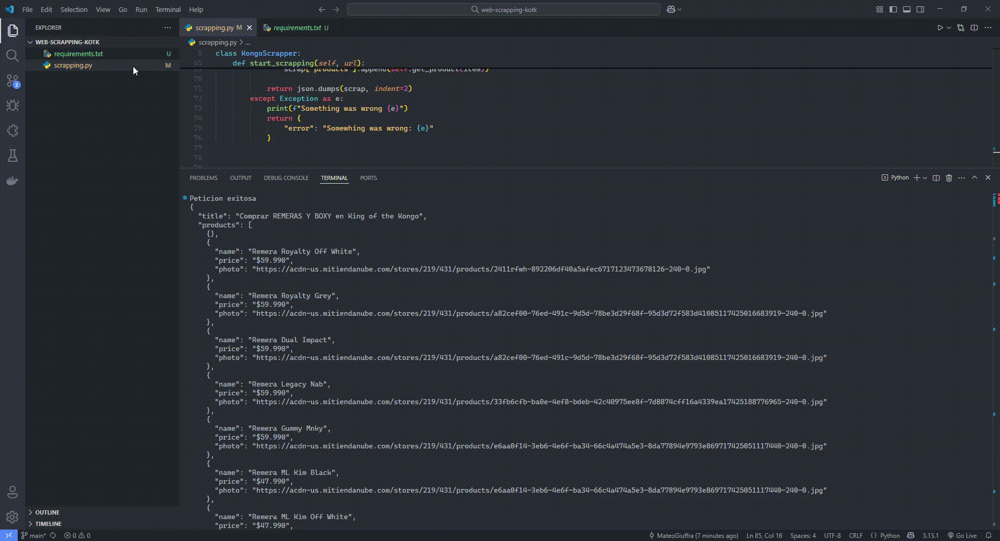

# KongoScrapper 🧢

Este proyecto es un scrapper desarrollado en Python con `requests` y `BeautifulSoup` que permite obtener productos del sitio [kingofthekongo.com.ar](https://kingofthekongo.com.ar), extrayendo información como:

- Nombre de la página 
Una lista de productos con:
- Precio
- Foto del producto
- Nombre del producto

## ¿Qué tiene de útil?

Funciona con **cualquier página** de productos del dominio `https://kingofthekongo.com.ar/productos/`, ya sea categorías como "remerones", "remeras y boxy", "pantalones", etc.

## Ejemplo de uso

```bash
python scrapper.py
```
## Ejemplo de salida
```bash
{
  "title": "Remerones - King of the Kongo",
  "products": [
       {
      "name": "Remeron Verified Grey",
      "price": "$57.990",
      "photo": "https://acdn-us.mitiendanube.com/stores/219/431/products/a...jpg"
    },
    {
      "name": "Remeron Teddy Mnky",
      "price": "$44.990",
      "photo": "https://acdn-us.mitiendanube.com/stores/219/431/products/e...jpg"
    },
    ...
  ]
}
```

## Dependencias

- Python 3.7+
- `requests`
- `beautifulsoup4`

Instalación rápida:

```bash
pip install -r requirements.txt
```

## Estructura

- `KongoScrapper` (clase principal)
  - `start_scrapping(url)` — Inicia el scraping
  - `get_product(item)` — Parsea cada producto del HTML
  - `get_photo_link(url_product)` — Obtiene el link de la imagen desde el detalle del producto
  - `get_price(price)` — Limpia el precio usando expresiones regulares
  - `get_link(url)` — Corrige URLs parciales de imágenes (hasta que encuentra `.jpg`)

## ¿Por qué lo hice?

Para practicar scraping real con estructuras de e-commerce, parsing de precios, navegación por HTML dinámico y buenas prácticas de organización de código con clases en Python.

Además, el scrapper es adaptable a cualquier categoría del sitio: `https://kingofthekongo.com.ar/productos/`, lo cual lo hace reutilizable para distintos fines como análisis de precios, catalogación o inventarios.

## Muestra


